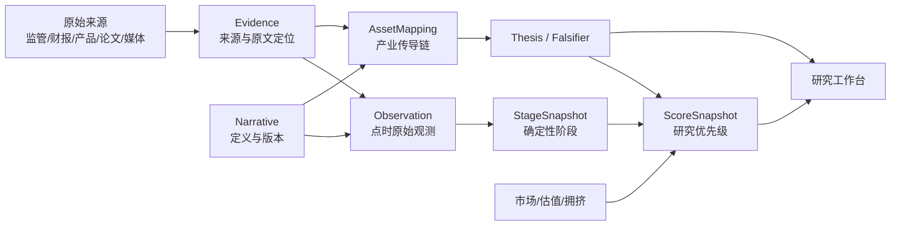

# invest 站点升级蓝图：从 mock 到可验证投研系统

版本：1.0.0
状态：设计蓝图，不在本轮改站或发布
目标：把现有展示原型迁移为点时、可复算、可证伪的研究工作台

## 1. 产品定位

站点不再回答“哪只股票分最高”，而回答五个连续问题：

1. 哪个 AI 叙事正在形成或衰减；
2. 叙事通过哪个产业节点传导；
3. 哪些 A 股公司拥有真实、可验证的关系；
4. 市场价格与基本面之间的缺口有多大；
5. 下一条会确认或推翻判断的证据是什么。

用户是内部研究与产品团队。默认周期 3–18 个月。所有页面显式标注 `事实/推断/假说/mock`，不提供买卖按钮、仓位、价格目标、收益承诺或自动交易接口。

## 2. 现状差距

| 维度 | 当前 mock | 生产要求 | 风险 |
|---|---|---|---|
| 数据身份 | 静态 JS 对象 | 对象 ID、schema、as-of、版本、hash | 无法复算 |
| 标的数量 | 文案60+，实际58 | 从 AssetMapping 动态计数 | 信任损失 |
| 产业链数量 | 声明102，与15/12/9/9/6/7不符 | 单一查询生成声明与列表 | 口径冲突 |
| 日期 | UI、Brief、资源时间不一致 | 全局 as-of + 每对象 event_time | 时间穿越 |
| 综合分 | 手工字段 | 冻结输入和计算版本 | 黑箱排名 |
| R₀ | 无定义/无函数 | 去重的时间变化 R_t | 伪科学精度 |
| 来源 | 标的无来源 | Evidence + locator + grade | 不可审计 |
| 阶段 | 手工标签 | StageSnapshot 规则生成 | 不可验证 |
| 风险 | 被总分掩盖 | 拥挤、缺失、证伪独立显示 | 错误确定性 |
| 历史 | 无点时快照 | append-only snapshots | 幸存者偏差 |

当前代码和数据可以作为视觉参考，不可原地“补几个字段”后宣布生产可用。必须先建立事实层和快照层，再迁移界面。

## 3. 目标信息架构



原则：UI 只读快照和解释码，不直接计算；计算服务只读冻结 Observation/Evidence；原始来源不可被计算结果覆盖。

## 4. 数据契约

### 4.1 公共元数据

所有对象必须有：

```json
{
  "id": "typed-id",
  "schema_version": "1.0.0",
  "valid_from": "ISO-8601",
  "valid_to": null,
  "as_of": "ISO-8601",
  "created_at": "ISO-8601",
  "source_snapshot_hash": "sha256:...",
  "status": "active|partial|expired|superseded",
  "provenance": ["evidence-id"]
}
```

禁止把 `updated_at=now()` 当作数据 as-of。页面刷新时间与证据时间分开。

### 4.2 Narrative 表

字段：`narrative_id`、名称、定义、包含、排除、同义词、反向叙事、父子关系、起点、episode、语言、版本。关键词只是召回工具，不能代替定义。

### 4.3 Evidence 表

字段：URL、publisher、grade、interest_position、published_at、effective_at、locator、excerpt_hash、independent_group、supports、contradicts、access_status。原文或依法可存的快照独立存储，UI 显示定位和 hash。

### 4.4 Observation 表

字段：entity、metric、value、unit、window、event_time、ingested_at、dedup_policy、calculation_version、source evidence。原始值与派生值分表，派生值保存输入 ID。

### 4.5 StageSnapshot 表

字段：narrative、as_of、stage、rule_version、inputs、missing_rate、confidence、explanation_codes。阶段变化生成新快照，不更新旧行。

### 4.6 AssetMapping 表

每条边独立：全球事件→产业需求、产业需求→产品节点、产品节点→公司供应、供应→订单、订单→收入利润。字段包含 edge grade、evidence IDs、validity、weakest edge、替代路线和 review_at。

### 4.7 Thesis/Falsifier 表

字段：statement、confirm metrics、falsifiers、deadline、status、evidence、owner、revision。旧 thesis append-only；修改假说创建新版本。

### 4.8 ScoreSnapshot 表

字段：input_snapshot_hash、weight_set、missing_policy、calculation_version、输出分轴和 explanation codes。冻结同一输入必须得到字节级一致的排序 JSON。

## 5. 计算链

### 5.1 取证与去重

1. 拉取允许的公开来源；
2. 保存响应时间、原始发布时间、canonical URL 和内容 hash；
3. 识别同一新闻稿转载和引用链；
4. 人工抽样验证主体、数字和语义；
5. 写入 Evidence，再生成 Observation。

抓取成功不等于证据有效；HTTP 200 也可能是动态壳或登录页。正文定位和最小长度需要验证。

### 5.2 叙事计算

按 narrative version 对文本召回，排除词过滤，再做近重复与主体去重。生成声量占比、速度、R_t、载体多样性、观点分歧、新颖度、衰减率。每次运行输出：输入条数、去重后条数、缺失率、覆盖源、版本和 hash。

### 5.3 阶段计算

规则引擎只消费点时指标。阶段阈值使用叙事自身滚动分位和最小样本数。缺失率超过阈值返回 unknown，不回退到手工标签。

### 5.4 映射计算

AssetMapping 不使用纯文本相似度直接确认公司。模型可提出候选边，但只有 Evidence 支持后才激活。公司映射等级取最弱边；缺少订单/收入证据时不进入“已兑现”。

### 5.5 市场计算

使用有授权的交易所级点时行情、估值、持仓和盈利预测。事件研究保存基准、预估窗口、事件窗口和异常收益；沪深 300 只能是通用对照，生产版还需行业/风格匹配。

### 5.6 研究优先级

先门控再排序：

- Evidence completeness <60%：不进入比较队列；
- 最弱映射边为 D：只进入观察池；
- 核心证据过期：状态 partial；
- 数据可用后分别生成叙事、兑现和市场风险轴；
- 研究优先级可排序，风险独立展示。

禁止用一个加权总分把“高叙事”和“高拥挤”相互抵消。

## 6. 页面层级

### 6.1 首页：研究雷达

首屏仅显示：全局 as-of、数据覆盖、partial 数量、叙事阶段迁移、本周新增证伪和下一验证节点。不要首屏放股票总榜。

叙事卡显示：阶段、7/28 日 R_t、扩散速度、多样性、新颖度、最近 S/A 催化、证据新鲜度、状态解释码。

### 6.2 叙事详情页

从上到下：定义与边界；生命周期时间线；原始事件；支持/反对叙事；传播网络；指标版本；相连产业节点；失效条件。

R_t tooltip 必须写：“独立传播载体扩散率；不是流行病学再生数或因果估计”。

### 6.3 产业链页

产业链不再是公司 Logo 列表，而是边图：全球定价源→规格/产品→BOM/瓶颈→公司→经营兑现。每条边展示证据等级和最弱边。用户可以切换“事实边”“推断边”“假说边”。

### 6.4 公司页

公司页顶部不显示总分，显示五联卡：

- 叙事阶段与扩散；
- 映射最弱边与基本面等级；
- 估值/拥挤；
- 研究优先级；
- 下一验证节点。

下方分别展示来源、订单/收入时间线、相反证据、thesis/falsifier 和历史快照。公司自述、媒体推断和交易所披露用不同视觉标签。

### 6.5 回放页

选择 T0 后展示 T-6 月可见信息、当时标的池、20/60/120/250 日、两个财报期、失败公司和时间穿越检查。默认同时显示绝对收益、匹配基准异常收益、盈利预测修正和经营兑现，避免只展示价格。

### 6.6 证据工作台

供研究员查看待确认候选、重复来源聚类、过期证据、缺失 locator、相反证据和抽样复算。所有人工修改形成审计日志。

## 7. 视觉语义

颜色只表达状态，不表达买卖：

- 蓝：事实/已验证；
- 紫：推断；
- 灰：未知/缺失；
- 橙：风险/待验证；
- 红：证伪或数据错误；
- 斜纹/水印：mock。

“高研究优先级”不可使用类似涨停红的视觉。所有图表显示单位、窗口、as-of 和数据覆盖。数字 hover 显示公式、输入版本和证据 ID。

## 8. API 草案

```text
GET /api/v1/narratives?as_of=&stage=
GET /api/v1/narratives/{id}/snapshots
GET /api/v1/evidence/{id}
GET /api/v1/observations?entity=&metric=&from=&to=
GET /api/v1/mappings?narrative=&company=&status=
GET /api/v1/theses?status=&review_before=
GET /api/v1/scores?as_of=&calculation_version=
POST /api/v1/replay             # internal authenticated research job only
GET /api/v1/replay/{job_id}
```

所有 GET 响应返回 `data_as_of`、`generated_at`、`schema_version`、`calculation_version`、`coverage`、`partial_reasons` 和 `payload_hash`。公开站点只读已批准快照，不暴露内部私有来源正文。

## 9. 迁移顺序

### Phase 0：冻结 mock

- 给当前数据加 `legacy_mock_hypothesis`；
- 保存线上/本地资源 hash 和计数审计；
- 页面加显著 mock 与 as-of 提示；
- 停止使用现有排名做研究判断。

验收：旧值不能进入新 API 或 ScoreSnapshot。

### Phase 1：证据与叙事真相层

- 实现 Narrative、Evidence、Observation schema；
- 接入少量高质量 S/A 来源；
- 去重、locator、独立来源组和 hash；
- 先选择三条试点：算力/CPO、AI PC、AI 制药。

验收：任一数字可以从 UI 回到原文定位；冻结输入重复运行一致。

### Phase 2：产业映射与证伪

- 实现 AssetMapping、Thesis/Falsifier；
- 交易所/财报点时证据；
- 最弱边与反方向传导；
- 两个财报期验证任务。

验收：只有名称相关的公司无法进入研究候选；失败条件到期自动提示。

### Phase 3：阶段和市场反身性

- 叙事指标与 R_t；
- StageSnapshot 规则；
- 估值、成交、持仓与预测修正；
- 行业/风格匹配事件研究。

验收：阶段无人工选择入口；同一快照可复算；无对照时 UI 只显示关联。

### Phase 4：研究优先级与回放

- 分轴展示和研究优先级；
- 点时回放、失败样本、权重敏感性；
- 数据覆盖和 partial 看板。

验收：权重扰动结果可见；历史标的池不可用后见信息改写。

### Phase 5：受治理发布

- 内容质量闸门、QA、隐私与权限审计；
- staging 与生产快照隔离；
- 人工批准发布。

验收：代码、部署、运行、数据新鲜度和业务结果分别出具回执；CI 或发布候选不等于上线结果。

## 10. 验收矩阵

| Gate | 通过条件 | 失败状态 |
|---|---|---|
| Schema | 七类对象通过 schema，版本可解析 | blocked_schema |
| Provenance | 核心数字100%有S/A原始定位 | partial_provenance |
| Freshness | 页面/对象明确as-of，过期告警 | partial_stale |
| Reproducibility | 冻结输入同版本字节级一致 | blocked_recompute |
| Point-in-time | 回放无未来证据和幸存者回填 | blocked_lookahead |
| Independence | 转载不重复计数 | partial_duplicate_source |
| Counterevidence | 每个thesis有反证和截止日期 | partial_falsifier |
| Sensitivity | 权重扰动与排名稳定性可见 | partial_unstable |
| UX semantics | 事实/推断/假说/mock可辨 | blocked_semantic |
| Safety | 无交易、支付、账户或外部发布越权 | blocked_human_gate |

## 11. 运行与审计

每次计算产生 run receipt：run_id、代码 commit、schema、输入 hash、来源覆盖、缺失率、开始/结束时间、输出 hash、警告和状态。每次页面发布产生独立 deployment receipt。运行成功不代表数据新鲜，部署成功不代表研究准入。

监控至少包括：抓取失败、正文壳页、去重异常、指标断点、阶段跳变、证据过期、映射边到期、计算 hash 漂移、UI/数据 as-of 不一致。异常必须 fail closed：保留上一批准快照并显示过期，不自动用缺失值重排。

## 12. 本轮不执行项

本蓝图没有改动 live invest 站点、没有发布、没有接入账户、没有形成买卖或仓位指令。历史价格回放仍是二级行情和重构标的池，不能作为生产回测。下一工程阶段开始前，应先批准数据源、存储位置、隐私边界和三条试点叙事。

## 13. 最小可行迁移的完成定义

MVP 不是“页面更漂亮”，而是任意选择一个叙事和一个公司，系统能回答并举证：叙事定义是什么；当前阶段由哪些冻结观测算出；全球事件通过哪条产业链连接公司；最弱证据边在哪里；哪条相反证据可能推翻判断；下一验证节点是什么；同一输入能否复算得到同一结果。

只有这些问题都可回答，invest 才从 mock 展示转为可验证研究系统。
